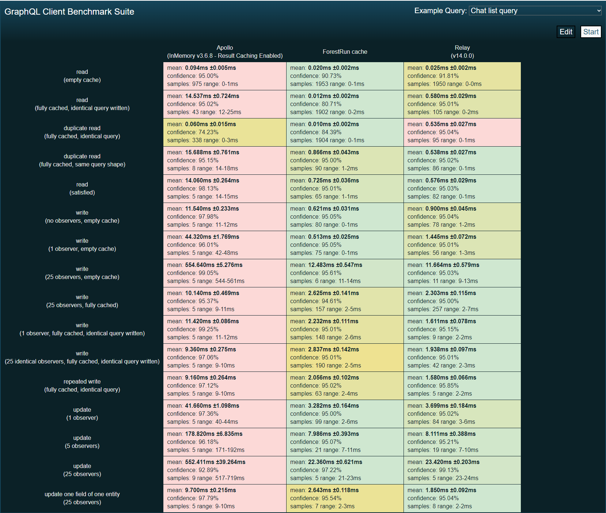

# Forest Run

**Experimental** denormalized cache for GraphQL clients using indexing for data syncing.

> Status: ideation / a rudimentary prototype

# Table of contents

<!-- TOC -->
* [Motivation](#motivation)
* [A different view on GraphQL client caches](#a-different-view-on-graphql-client-caches)
* [Architecture](#architecture)
    * [Overview](#overview)
    * [GraphQL results syncing](#graphql-results-syncing)
        * [1. Indexing operation result](#1-indexing-operation-result)
        * [2. Diffing individual entities](#2-diffing-individual-entities)
        * [3. Applying patches](#3-applying-patches)
    * [Handling stale data](#handling-stale-data)
    * [Aggregated Entity Views](#aggregated-entity-views)
    * [Additional constraints](#additional-constraints)
* [Performance](#performance)
* [Features](#features)
    * [Garbage Collection](#garbage-collection)
    * [Offload work to a worker thread](#offload-work-to-a-worker-thread)
    * [Sub-query reads](#sub-query-reads)
    * [Fragment reads](#fragment-reads)
    * [Fragment watching mode](#fragment-watching-mode)
    * [Support for `@defer` and `@stream`](#support-for-defer-and-stream)
    * [Local state](#local-state)
    * [Compaction](#compaction)
* [FAQ](#faq)
<!-- TOC -->

# Motivation

All major GraphQL clients use "normalization" as a method to keep data in cache up-to date.
However, normalization is not a silver bullet and has associated costs:
performance overhead, necessity of garbage collection, consistency pitfalls due to partial nature of data in GraphQL,
and increased overall complexity of GraphQL client cache
(read about [normalization pitfalls][1] to learn more about motivation behind this project).

Forest Run aims to explore an alternative to "normalization" that doesn't require central store to keep data up to date.

Expected benefits:

- Simpler implementation
- Better performance (especially for cache reads)
- Natural garbage collection
- Predictable behavior
- Easy to debug and monitor
- Ready for live-queries

# A different view on GraphQL client caches

We view GraphQL clients as basically emulations of ["live queries"][2] running locally.
Clients keep those "local live queries" up-to date by syncing with overlapping data from other incoming GraphQL operations
(mutations, subscriptions, other queries).

In this view of the world, normalized store is primarily an implementation detail of this "syncing" mechanism.
It is not a source of truth or data storage for local state. Or at least, it doesn't need to be.

# Architecture

## Overview

Unlike normalized caches where data is stored in a single object and then propagated to "local live queries"
via cache reads, Forest Run preserves data in the original shape as it comes from GraphQL server, and attempts
to keep results _in sync_ for all "local live queries" on incoming writes.

All heavy lifting is happening where you naturally expect it: during _writes_.
Reads are `O(1)` lookups by a key (with a [few exceptions](#no-cross-query-reads)).

So how can data syncing work without normalization?

## GraphQL results syncing

In ForestRun data syncing is a 3-step process:

1. Indexing incoming operation result
2. Diffing individual entities
3. Applying patches to existing "local live queries"

This separation into steps is a deliberate design decision allowing some further optimizations and features,
like building indexes on the server or [offloading](#offload-work-to-a-worker-thread)
both indexing and diffing to a worker thread
(when patches are sent to the main thread for incremental "live query" state updates).

In addition, it improves overall debuggability and traceability because it is possible to
capture history of every GraphQL result.

Let's briefly walk through every step individually.

### 1. Indexing operation result

Indexing is a process of remembering positions of individual entities (aka nodes) inside query result.

Imagine we are querying a post with a list of comments:

```graphql
query {
  post(id: "p1") {
    __typename
    id
    title
    comments {
      __typename
      id
      text
    }
  }
}
```

And receive the following data from the server:

```js
{
  post: {
    __typename: `Post`,
    id: `p1`,
    title: `My first post`,
    comments: [
      {
        __typename: "Comment",
        id: "c1",
        text: "hello"
      },
      {
        __typename: "Comment",
        id: "c2",
        text: "world"
      }
    ]
  }
}
```

Indexing algorithm will create the following data structure for this data:

```js
const index = {
  "Post:p1": [
    {
      reference: {/*...*/}, // the actual reference to the Post object in the GraphQL result
      path: ["post"],
    },
  ],
  "Comment:c1": [ { reference: {/*...*/}, path: ["post", "comments", 0] } ],
  "Comment:c2": [ { reference: {/*...*/}, path: ["post", "comments", 1] } ],
};
```

At a first glance it may seem similar to normalization, but there are several important differences:

1. Indexing doesn't have to loop through all keys of all objects (it only cares about individual objects, not fields).
2. It also doesn't have to copy values of all object keys to the store object.
3. Index is created per-result, it is not global. So it can be disposed together with the result when it is no longer needed.

Another important thing to note is that **index can be built in part on the server** and sent alongside GraphQL result:

```js
const result = {
  data: {
    /*...*/
  },
  extensions: {
    index: {
      Post: {
        p1: [{ path: ["post"] }],
      },
      Comment: {
        c1: [{ path: ["post", "comments", 0] }],
        c2: [{ path: ["post", "comments", 1] }],
      },
    },
  },
};
```

This raw object can be used immediately during diffing phase.
Specific `reference` could be resolved lazily when needed.

### 2. Diffing individual entities

After indexing, we walk through all found ids and look for other
"local live queries" that have this entity in their index. For each found document we run a `diff` algorithm that
produces a set of patches that need to be applied to operation result to update it to the latest state.

Example. Imagine the author edits his comment `c1` and replaces text `hello` with `hi`. So the following mutation is issued:

```graphql
mutation {
  editComment(id: "c1", text: "hi") {
    __typename
    id
    text
  }
}
```

And the incoming mutation result is:

```js
const data = {
  __typename: "Comment",
  id: "c1",
  text: "hi"
}
```

Now we need to sync the state of all our "local live queries" with this latest state.
After indexing this result, we see that it contains entity with id `Comment:c1`.
Next we find that the index of our original Post query also contains entity with the same id
`Comment:c1` (see [above](#1-indexing-operation-result)).

We can access entity object from both results quickly through respective indexes.
And so we `diff` this specific entity representation with the same entity `Comment:c1` stored in the original query
to get a patch:

```js
const patch = {
  path: ["post", "comments", 0, "text"],
  data: "hi"
}
```

After diffing all entities, we get a list of patches that need to be applied to update the original
operation result to the latest state of the world.

If there is no difference and all entity fields were compared, we assume that the entity hasn't changed.
So we can skip diffing remaining "local live queries" and bail early.

> Note: this is just conceptual overview. Diffing is the most complex part of the implementation
> and has many nuances for performance and data staleness (especially around list diffing).

### 3. Applying patches

After diffing all entities we get a collection of patches for each "local live query". Unaffected "local live queries"
will have empty patch sets which means their state hasn't changed. For others, we go ahead and apply those patches.

Patch application produces a single copy of the original object and all affected nested objects.
No unnecessary allocations, structured sharing is guaranteed (re-using the same objects if they were not affected).

Applying patches works similar to [immer][3], but with improved performance because we can rely on GraphQL
spec with additional assumptions about structure of the data.

## Handling stale data

Our research on [normalization pitfalls][1] shows that in general it is not possible to always keep data in cache
up-to-date using only incoming GraphQL results. At some point some data becomes stale or even inconsistent
(due to partial data updates).

So staleness of data has to be taken into account at cache design level. The best we can expect from
general purpose GraphQL client is "eventual consistency" (which is fine for most UI applications).
And so there should be several ways to achieve it.

ForestRun tracks data staleness at entity (aka node) level.
It means that:

1. It can keep other parts of the data in sync even when some part is stale.
2. Initiate data re-fetching for individual entities rather than the whole query to restore consistent state
   (this has to be supported at a schema level).

Obviously, full query re-fetching is a last-resort method and is always possible.

Staleness detection occurs at diffing step. Technically, `diff` returns not just a list of patches but also a list
of stale entities (with specific stale fields).

## Aggregated Entity Views

In ForestRun, state of individual entity is spread across multiple GraphQL operation results.
There is no single centralized state as in the normalized store.
This may seem counter-intuitive, but it makes sense for the UI application, where true data consistency cannot be
guaranteed and the actual source of truth lives somewhere else.

Having said that, it is quite convenient to have a single view into entity's current state across all chunks.
This is achieved through aggregated entity views.

It is basically a short-living object that is created on demand (e.g. for diffing phase). This object is fed
with different chunks of the same entity found in different GraphQL results (via indexing) and so is a convenience tool
to represent single entity state from multiple chunks.


## Additional constraints

### No cross-query reads

Normalized cache is convenient for reading data that was "sourced" into the store via different queries.
However, this is also fragile because changes to one query (or subscription) may cause sudden bursts of network requests
or straight out failures in seemingly unrelated "local live queries"
(see [Example 5 in normalization pitfalls](./docs/normalization-pitfalls.md#example-5-non-deterministic-behavior) document).

In general Forest Run doesn't allow cross-query reads. The main scenario is reading the result of any
"active live query" (which is a `O(1)` lookup).

However, there are two additional "read" patterns that ForestRun supports:
[sub-queries](#sub-query-reads) and [fragments](#fragment-reads).

### Exact fragment reads

Fragment reads rely on "identical" fragment (either by AST or fragment name if you keep them globally unique).
It is possible to read fragments only if at least one "local live query" includes this exact fragment.

This ensures that fragments reads are always fast or impossible.

# Performance

See first results of a rough proof-of-concept implementation.
Take write perf with a grain of salt, but reads are blazing-fast by design
("satisfied read" and "same query shape" are basically [sub-query reads](#sub-query-reads)).



# Features

## Garbage Collection

Garbage collection is trivial. As long as query results are no longer needed to render the UI, the component is
unmounted and query data with all associated indexes is released.

Since there is no central store, it will be garbage-collected automatically by the JS runtime.
It is possible to opt-out of garbage collection by explicitly retaining the results.

## Offload work to a worker thread

Since the actual state update of "local live queries" is designed as a set of patch applications,
_indexing_ and _diffing_ may be moved to a worker thread.

In this case the only complexity that remains in the main thread is to apply patches that arrive from the server/worker.
In case of data losses, client can always re-request full "live query state" from the server/worker.

This model can also significantly reduce communication overhead (as patches are generally much smaller than full documents).
The downside is increased memory consumption, because each "local live query" result will exist in both main thread and worker.

## Ready for live query

This tooling could be a building block for server-side (or in-worker) implementation of live-queries.

The missing pieces are about invalidation of individual entities (and especially lists/connections).


## Sub-query reads

ForestRun doesn't support [cross-query reads](#no-cross-query-reads) (and we don't think any GraphQL client should!).

But it does support sub-query reads.

For example, you may fetch a list of users with a single query and then read separate queries for individual users
(with the same selectionSet as in the list query). This won't require a separate network call.

But in this case you must explicitly declare dependencies between your container and item queries with a GraphQL directive.
This leads to deterministic cache behavior and allows detection of selection set inconsistencies via static analysis
(e.g. maybe you add a field to individual query but not to the list one, which may lead to a burst of network requests).

## Fragment reads

Fragment reads are supported but only if at least one "local live query" includes this exact fragment
for a given data id.

This ensures that fragments reads are always fast or impossible.

> Technically it is possible to implement custom fragment reads via [Aggregated Entity Views](#aggregated-entity-views)
> but in most cases it is a sign of incorrect app design and is not supported out of the box.


## Fragment watching mode

Relay has pioneered an approach of watching for changes at a fragment level. This allows UI to avoid expensive
re-renders of the whole UI tree and re-render only the leafs were the data has actually changed.

With forest run it is possible to watch for changes at individual fragment level.
Essentially, a watch needs a fragment and a `path` to fragment data within the query result (analogous to Relay ref).

So whenever `diff` produces patches, we can detect which watched fragments are affected by current change and notify
them.

## Support for `@defer` and `@stream`

The architecture of ForestRun gets along nicely with [defer and stream RFC][4], because this RFC models incremental
response as patches, so as long as our patch format is compatible with this RFC,
it will require minimal integration efforts.

Having said that, it still requires a bit more research.

## Local state

> Local resolvers will work out of the box

Using GraphQL client store as a [shared mutable state][5] that can be updated from anywhere - server state,
local state or custom `writeQuery` / `writeFragment` calls is a direct path to all sorts of bugs.

That's why Forest Run decouples local state from the server state. Internally, server state is always automatically
updated on any incoming server data. This state should be never manually mutated.
It is kept in sync automatically by Forest Run when possible.

Local state is modeled as a set of transforms that each return a "patch" for the server data.
To re-iterate, local transforms do not produce new versions of query state, instead, each of them produces
its own patch for the server data.

This way we can debug changes applied by individual local transforms, discover conflicting changes, batch
patches into single updates, re-use existing patches instead of re-running transforms (when possible),
have undo with inverse patches etc.

Local changes are applied on top of the server state for each watched query. So the final query result
that is passed to UI is a function of a server state + local state.

Local state includes optimistic updates, schema extensions from the local store, etc.


Local state, however, does live on the client. But it is often a function of server data and some local data,
similar to how in React your UI is a function of props and state, the actual local state is also a function of a server data and local data.

# FAQ

> TODO


[1]: ./docs/normalization-pitfalls.md
[2]: https://medium.com/open-graphql/graphql-subscriptions-vs-live-queries-e38302c7ab8e
[3]: https://immerjs.github.io/immer/patches
[4]: https://github.com/graphql/graphql-wg/blob/main/rfcs/DeferStream.md
[5]: http://henrikeichenhardt.blogspot.com/2013/06/why-shared-mutable-state-is-root-of-all.html
